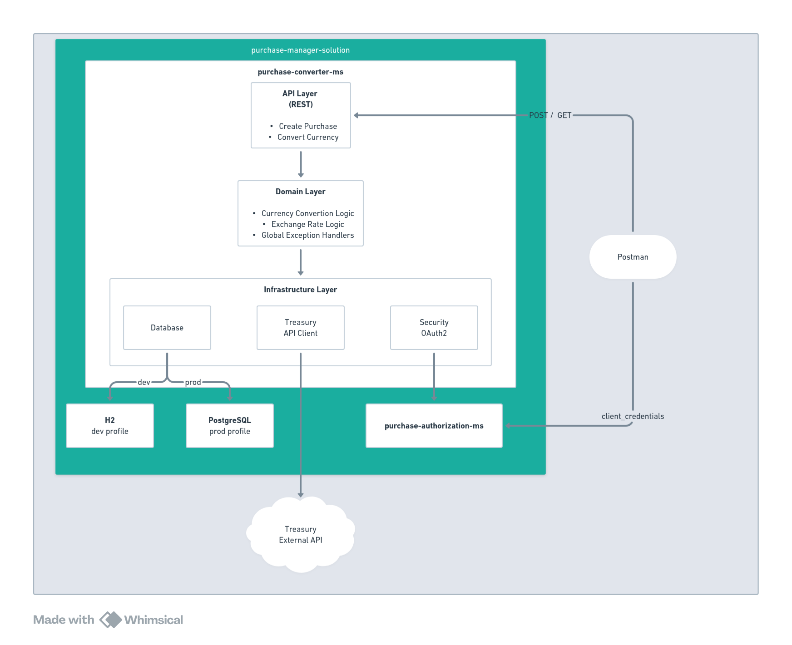

# Purchase Manager Solution

## Overview

This solution implements a microservices-based architecture for managing purchase transactions and currency conversions using the Treasury Reporting Rates of Exchange API.

## Architecture



The solution consists of two microservices:

### 1. Purchase Converter Microservice (`purchase-converter-ms`)
The main application service that handles:
- **API Layer (REST)**
    - Create purchase transactions
    - Convert currency for stored purchases
- **Domain Layer**
    - Currency conversion logic
    - Exchange rate logic
- **Infrastructure Layer**
    - Database persistence
    - Treasury API client
    - OAuth2 security integration

### 2. Purchase Authorization Microservice (`purchase-authorization-ms`)
Security and authentication service that provides OAuth2-based authorization for the main service.

## System Components

### External Dependencies
- **Treasury External API**: US Treasury Reporting Rates of Exchange API for currency conversion rates

### Database Profiles
- **H2 (dev profile)**: In-memory database for development
- **PostgreSQL (prod profile)**: Production-ready database

### Test Tool
- **Postman**: Client application for testing and interacting with the API


## Technical Stack

- **Language**: Java
- **Framework**: Spring Boot
- **Security**: OAuth2
- **Database**: H2 (dev) / PostgreSQL (prod)
- **Containerization**: Docker Compose
- **API Documentation**: Swagger UI

## Requirements Implementation

### Requirement #1: Store Purchase Transaction
The solution stores purchase transactions with:
- **Description**: Max 50 characters
- **Transaction date**: Valid date format
- **Purchase amount**: Positive amount in USD, rounded to nearest cent
- **Unique identifier**: Auto-generated unique ID

### Requirement #2: Retrieve with Currency Conversion
The solution retrieves purchases converted to target currencies:
- Returns: identifier, description, transaction date, original USD amount, exchange rate, converted amount
- Uses Treasury API exchange rates within 6 months of purchase date
- Returns error if no rate available within 6-month window
- Converted amounts rounded to 2 decimal places

## Running the Solution

```sh
sh build-and-run.sh
```

## API Documentation

Access Swagger UI at:
```
http://localhost:8080/swagger-ui/index.html
```

## Security

The solution implements OAuth2 authentication:
- Authorization microservice issues access tokens
- Converter microservice validates tokens via `client_credentials` flow
- Requests require valid `access_token` header

### Registered Client Repository

The solution uses an in-memory `registeredClientRepository` with a pre-configured OAuth2 client for demonstration purposes only:

- **Client ID**: `client1`
- **Client Secret**: (configured in the authorization service)
- **Grant Type**: `client_credentials`

**Important**: This `client1` configuration is for demonstration and testing purposes only. In a production environment, clients should be:
- Stored in a secure database
- Managed through a proper client registration process
- Use secure secret management practices
- Implement appropriate rotation policies

### RSA Key Generation

The RSA key pair used for JWT token signing was generated using OpenSSL:

```sh
openssl genrsa -out keypair.pem
openssl rsa -in keypair.pem -pubout -out public.pem
openssl pkcs8 -topk8 -inform PEM -outform PEM -nocrypt -in keypair.pem -out private.pem
rm keypair.pem
```

This generates:
- `public.pem`: Public key for token verification
- `private.pem`: Private key for token signing


## Testing

A Postman collection is provided for API testing: `Purchase_Manager.postman_collection.json`

### Testing with Postman

Follow these steps in order:

#### 01 - Get Access Token for SCOPE_purchase
First, obtain an OAuth2 access token from the authorization service:

- **Endpoint**: `POST http://localhost:9090/oauth2/token`
- **Body** (x-www-form-urlencoded):
  - `grant_type`: `client_credentials`
  - `client_id`: `client1`
  - `client_secret`: `password1`
- **Response**: Returns `access_token` which is automatically saved to global variable `{{accessToken}}`

#### 02 - Create Purchase
Create a new purchase transaction using the access token:

- **Endpoint**: `POST http://localhost:8080/api/purchases`
- **Authentication**: Bearer Token using `{{accessToken}}`
- **Body** (JSON):
  ```json
  {
    "description": "{{$randomProductName}}",
    "transactionDate": "2022-10-01",
    "purchaseAmount": "1000.00"
  }
  ```
- **Response**: Returns created purchase with `id` which is automatically saved to global variable `{{purchaseId}}`

#### 03 - Get Converted Purchase
Retrieve a purchase transaction converted to a target country's currency:

- **Endpoint**: `GET http://localhost:8080/api/purchases/{{purchaseId}}/convert?country=Sweden`
- **Authentication**: Bearer Token using `{{accessToken}}`
- **Query Parameters**:
  - `country`: Target country for currency conversion (e.g., `Sweden`)
- **Response**: Returns the purchase with:
  - Original purchase details (id, description, transaction date, USD amount)
  - Exchange rate used for conversion
  - Converted amount in target currency


## Deployment

The solution is fully containerized using Docker Compose:
- No separate database installation required
- No separate web server installation required
- All dependencies managed through containers

## Test Cases

### Purchase Converter Microservice

The purchase-converter-ms includes comprehensive test coverage across multiple layers:

#### Application Context Tests
- **Context Loads**: Validates that the Spring Boot application context loads successfully with Testcontainers configuration

#### Treasury API Client Tests (Integration)
- **Valid Exchange Rate Retrieval**: Fetches exchange rates for valid countries (Brazil, Canada, Mexico, United Kingdom, Japan, Euro Zone) and dates
- **Recent Date Handling**: Validates exchange rate retrieval for dates within the last month
- **Invalid Country Handling**: Returns empty result for non-existent countries
- **Future Date Validation**: Throws exception when purchase date is in the future
- **Today Date Handling**: Accepts today's date without throwing exceptions
- **Six Month Window**: Validates the 6-month lookback window for exchange rates
- **Historical Date Support**: Successfully retrieves rates for historical dates (2023-06-01)
- **Consistency**: Ensures multiple calls with same parameters return identical results
- **Configuration Validation**: Verifies Treasury API configuration is loaded correctly

#### Purchase Service Tests (Unit)
- **Create Purchase Success**: Creates purchase transaction and returns response with all fields
- **Get Purchase with Currency Conversion**: Converts purchase amount using exchange rate from Treasury API
- **Purchase Not Found**: Throws PurchaseNotFoundException for non-existent purchase IDs
- **No Exchange Rate Available**: Throws CurrencyConversionException when no rate exists within 6-month window
- **Decimal Rounding**: Validates converted amounts are rounded to 2 decimal places (e.g., 100 × 1.3333 = 133.33)

#### Purchase Controller Integration Tests
- **Create Purchase - Valid Request**: Returns HTTP 201 with purchase details for valid inputs
- **Create Purchase - Invalid Description**: Returns HTTP 400 when description exceeds 50 characters
- **Create Purchase - Negative Amount**: Returns HTTP 400 for negative purchase amounts
- **Get Converted Purchase - Valid Request**: Returns HTTP 200 with converted amount and exchange rate
- **Get Converted Purchase - Non-Existent ID**: Returns HTTP 404 for invalid purchase IDs
- **Get Converted Purchase - No Exchange Rate**: Returns HTTP 400 when no rate available within 6 months
- **OAuth2 Security**: All endpoints require valid JWT token with SCOPE_purchase authority
